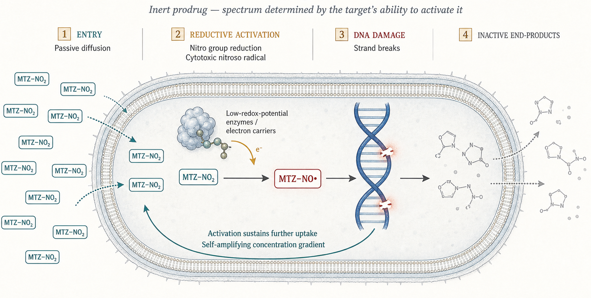

## Metronidazole, Fosfomycin and Nitrofurans {background-color="#b20e10" background-opacity="0.5"}

**Russell E. Lewis, Pharm.D**   Associate Professor of Infectious Diseases (MEDS-10/B)  

   

{fig-align="center" width="350"}

   russelledward.lewis\@unipd.it    [https://github.com/Russlewisbo](https://github.com/Russlewisbo/ESCMID_2022_talk)   Slides and course materials: [www.idpadova.com](https://padovaid.com/)

 

## Learning Objectives

 

- Explain metronidazole's **prodrug activation** and why it is selective for anaerobes — and where that selectivity leaves gaps
- Recall metronidazole's pharmacokinetics, signature toxicities, the warfarin interaction, and why it was **demoted in *C. difficile* infection**
- Map the three urinary-tract agents — **nitrofurantoin, fosfomycin, methenamine** — to their mechanisms, niches, and correct clinical roles
- Justify why nitrofurantoin and fosfomycin are **first-line for cystitis** but useless for pyelonephritis, and why methenamine is **prophylaxis only**
- Apply the recent trial evidence (Huttner 2018, ALTAR 2022) that has refined how we use these agents

## Two halves, one theme

 

- **Part I — Metronidazole:** a drug being *displaced* from indications it once owned (CDI, parts of the anaerobic and antiprotozoal space)
- **Part II — Urinary tract agents:** old drugs kept, or revived, for **uncomplicated cystitis** in an era of resistance and stewardship
- Common thread: **absorption, distribution, and site concentration** determine success far more than the in vitro MIC

::: aside
Each shows a PK property driving the clinical story. For metronidazole, complete absorption is the problem in the gut lumen. For the urinary agents, urinary concentration is the whole point. This is a useful teaching contrast to run through the session.
:::

# Part I — Metronidazole {background-color="#b20e10"}

## History and structure

 

- Azomycin (a 2-nitroimidazole) isolated from *Streptomyces* in 1953; metronidazole (a 5-nitroimidazole) synthesized 1959 for trichomoniasis
- Antibacterial activity found **serendipitously** in 1962 — a trichomoniasis patient's ulcerative gingivitis resolved
- Class: **5-nitroimidazoles** (metronidazole, tinidazole, secnidazole, ornidazole) — imidazole ring with a nitro group at position 5

::: aside
The entire anaerobic indication opened from an incidental observation of gingivitis clearing. Structurally the class is defined by the 5-position nitro group, which is the business end of the molecule — everything about mechanism and resistance turns on what happens to that nitro group.
:::

## Mechanism — An inert prodrug

 

{fig-align="center" width="800"}

::: aside
The drug does nothing until an organism reduces its nitro group; the short-lived nitroso radical then shreds DNA. Because activation itself pulls more drug into the cell, susceptible organisms accumulate the active form quickly. Everything downstream — selectivity, the resistance mechanisms, the protozoal activity — follows from this single fact [@Edwards1993; @Dingsdag2018].
:::

## Why metronidazole is selective for anaerobes

 

- Anaerobes reduce the nitro group using **low-redox-potential electron carriers** — ferredoxin/flavodoxin, fed by **pyruvate:ferredoxin oxidoreductase (PFOR)**
- Aerobes lack carriers negative enough to activate the drug
- The active form is **re-oxidized by oxygen** back to prodrug → activity confined to anaerobic/microaerophilic niches
- *H. pylori* uses an oxygen-insensitive nitroreductase (**RdxA**); *Giardia*, *Entamoeba*, *Trichomonas* have bacteria-like nitroreductases

::: aside
Two mechanisms enforce anaerobic selectivity: only anaerobes have electron carriers negative enough to reduce the nitro group, and oxygen actively reverses activation. This is why the drug is inert against aerobes and why microaerophilic protozoa are still susceptible. The RdxA point matters for H. pylori resistance later [@Edwards1993].
:::

## Spectrum — and two important gaps

 

- Reliable against **gram-negative anaerobes** (*Bacteroides*, *Fusobacterium*, *Prevotella*, *Porphyromonas*) and the **Clostridia**
- **Intrinsic-resistance gap:** non-spore-forming gram-positive anaerobes — *Actinomyces*, *Cutibacterium acnes*, *Lactobacillus*, *Bifidobacterium*, *Propionibacterium*
- Facultative organisms are not reliably covered

::: aside
The gram-positive-anaerobe gap is a key clinical point. When someone reaches for metronidazole to "cover anaerobes," remind them it misses Actinomyces and Cutibacterium acnes entirely — so aAtinomycosis and C. acnes device infections are not metronidazole-treatable. This gap recurs in the lung-abscess story [@Lofmark2010; @LeCorn2007].
:::

## Protozoa and the microbiome

 

- Reliable antiprotozoal activity: *Trichomonas vaginalis*, *Giardia*, *Entamoeba histolytica*, *Dientamoeba fragilis*
- These microaerophilic protists carry **bacteria-like nitroreductases** that activate the drug
- Broad activity comes at a cost: metronidazole perturbs the anaerobic gut microbiome
- Microbiome disruption is part of why alternatives are now preferred in some luminal indications

::: aside
The antiprotozoal reach is a direct consequence of the same activation biology — these protozoa reduce the nitro group much as anaerobic bacteria do. Keep the microbiome cost in mind: it is one of the quiet arguments behind moving away from metronidazole in giardiasis and CDI, where sparing the anaerobic flora matters.
:::

## Pharmacokinetics — Near-ideal for an anti-anaerobe

 

- Oral bioavailability **\~100%**; protein binding **\<20%**; excellent tissue and **CSF penetration** (≈ serum, even with non-inflamed meninges)
- Penetrates abscesses, bile, peritoneal and pancreatic tissue well
- Parent half-life **\~6–10 h** (mean ≈ 8 h); hepatic oxidation is the main route, yielding an **active hydroxy metabolite** with **30–65% of parent activity** and a **longer half-life (\~11–13 h)**
- Killing is **concentration-dependent** (like aminoglycosides/fluoroquinolones) — the PD driver is **AUC/MIC**, not time above MIC
- **50% dose reduction in significant hepatic disease**; supplemental dose after hemodialysis; no routine renal adjustment

::: aside
The PK is a genuine strength — complete absorption, low protein binding, and CSF levels that make it valuable in brain abscess. But hold onto "complete absorption": it is exactly what undermines the drug in the gut lumen, which is the CDI story two slides on. Remember the hepatic dose reduction and the post-dialysis supplement [@Freeman1997; @Earl1989].
:::

## Adverse effects

 

- Common, mild, reversible: nausea, **metallic taste**, GI upset
- **Prolonged therapy (\>4 weeks)**: reversible CNS toxicity (encephalopathy, ataxia, dysarthria, seizures) and **peripheral neuropathy**
- Avoid in the **first trimester**; large studies show no clear malformation signal in later pregnancy

::: aside
Short courses are very well tolerated; the neurotoxicity concern is a function of duration, so it surfaces in prolonged or repeated courses. Peripheral neuropathy may lag and can be slow to resolve. The pregnancy position is pragmatic: avoid first-trimester where possible, but the epidemiologic data are reassuring for later use when needed [@Kuriyama2011; @DiavCitrin2001].
:::

## Resistance mechanisms

 

- All follow from the activation pathway: reduced uptake, efflux, **reduced activation**, drug inactivation, enhanced DNA repair
- **Anaerobes:** *nim* genes (*nimA*–*nimH*) encode a reductase making an **inert amino** derivative — but a *nim* gene does **not** reliably predict phenotypic resistance
- ***H. pylori*****:** loss of activation via **RdxA / FrxA** mutations (global resistance now 40–90%)
- ***Trichomonas*****:** clinical failure is usually **"aerobic resistance"** (raised intracellular O₂ reoxidizes the radical)
- ***Giardia*****:** refractory disease increasing (failure \~20%)

::: aside
Resistance is best understood as "anything that stops the nitroso radical forming or persisting." The nim genes are the classic anaerobe mechanism, but carriage doesn't equal phenotype — an important caveat for molecular reporting. H. pylori loses the activating nitroreductase; Trichomonas typically fails by an aerobic mechanism that reoxidizes the active form; and refractory giardiasis is a growing real-world problem. Each maps back to the activation biology [@Dingsdag2018; @Alauzet2017].
:::

## The warfarin interaction and the alcohol myth

 

- **Warfarin:** metronidazole inhibits S-warfarin metabolism → marked INR rise. **Pre-emptively reduce warfarin \~20–30%** and monitor closely — the most clinically dangerous interaction
- Also raises busulfan, lithium, phenytoin, calcineurin inhibitors
- **Disulfiram-like reaction with alcohol** is widely taught but **evidence is weak** — one controlled study found none; still reasonable to advise avoidance

::: aside
The INR can climb dangerously, and a pre-emptive dose reduction is the right move. Present the alcohol reaction honestly: it is a teaching staple with contested evidence; continue to advise abstinence, but do not overstate the certainty. Tinidazole and secnidazole are not CYP2E1 substrates and are unlikely to cause it [@Holt2010; @Visapaa2002].
:::

## Clinical uses — Where metronidazole still wins

 

- **Trichomoniasis:** nitroimidazoles are the **only FDA-approved class** (safe in pregnancy)
- **Amebiasis / giardiasis:** effective, but amebic disease **must be followed by a luminal agent** (paromomycin); tinidazole/nitazoxanide now preferred first-line for giardiasis
- **Anaerobic infections:** intra-abdominal, CNS (brain abscess — CSF penetration), gynecologic, oral/dental, bacterial vaginosis
- **Component of *H. pylori* quadruple therapy** — works even when in vitro "resistant"

::: aside
Metronidazole still owns trichomoniasis and remains central to anaerobic and CNS anaerobic infection because of its penetration. The amebiasis teaching point: tissue amebicide plus a luminal agent to clear the cyst-passing state. The H. pylori paradox — in vitro resistance not predicting failure within combination therapy — is a nice reminder that susceptibility testing is not destiny [@Workowski2021; @Shih2022].
:::

## Trichomoniasis and the protozoal indications

 

- **Trichomoniasis:** metronidazole 500 mg PO bid × 7 d (women) is now preferred over single 2 g; tinidazole/secnidazole also approved — the **only FDA-approved class**; treat partners
- **Giardiasis:** tinidazole (single dose) or nitazoxanide now first-line; metronidazole 5–7 d is an alternative
- **Amebiasis:** metronidazole/tinidazole for invasive disease, **always followed by a luminal agent** (paromomycin) to clear the colonizing state

::: aside
Trichomoniasis is the indication metronidazole still fully owns — note the shift to a 7-day regimen in women (better cure than single-dose), and always treat the partner. For giardiasis the single-dose nitroimidazoles and nitazoxanide have overtaken metronidazole on convenience and tolerability. The amebiasis rule — tissue amebicide plus luminal agent — is a perennial exam favourite [@Workowski2021].
:::

## Metronidazole — Dosing by indication

 

| Indication                    | Typical regimen                            |
|------------------------------------|------------------------------------|
| Serious anaerobic infection   | 500 mg IV/PO q8–12h                        |
| Bacterial vaginosis           | 500 mg PO bid × 7 d (or vaginal gel)       |
| Trichomoniasis                | 500 mg PO bid × 7 d                        |
| Giardiasis                    | 250 mg PO tid × 5–7 d                      |
| Amebic colitis/liver abscess  | 500–750 mg PO tid × 7–10 d + luminal agent |
| *H. pylori* (as part of quad) | 500 mg PO bid–tid                          |

::: aside
A reference slide — these are the doses to carry. Note the recurring 500 mg unit and the shift toward q12h dosing for many indications. The amebiasis line is the one that trips people up: the tissue course is incomplete without the follow-on luminal agent. Reduce all of these by half in significant hepatic disease.
:::

## Dosing frequency — The PK/PD case for q12h

 

- Metronidazole kills anaerobes in a **concentration-dependent** fashion, so **AUC/MIC** — not dosing frequency — is what matters
- Monte Carlo simulation: **AUC/MIC ≥ 70** is the anaerobic target; **1000 mg/day** achieves **\>99% target attainment** against *B. fragilis* at MIC \< 2 mg/L — **independent of whether the total is split q8h or q12h**
- The **long parent half-life (\~8 h)** plus an **active hydroxy metabolite (\~11–13 h, 30–65% of parent activity)** sustain exposure across a 12-h interval
- On **500 mg q12h**, measured troughs (\~**6–7 mg/L**) sit at or below the **CLSI anaerobe breakpoint (≤ 8 mg/L)** while peaks reach \~**17–24 mg/L**

::: aside
This is the pharmacologic argument behind the increasingly common q12h (BID) dosing of metronidazole. Because killing is concentration-dependent, the relevant PD index is AUC/MIC, and Sprandel's Monte Carlo work shows that a fixed daily dose meets the AUC/MIC ≥ 70 target essentially regardless of how it is divided. The long half-lives of the parent and the active hydroxy metabolite mean exposure does not collapse over a 12-h gap. Earl's 1989 surgical-patient data anchor the concentration numbers: q12h dosing still yields troughs several-fold above the MIC of typical Bacteroides. Caveat: this reasoning is best validated for Bacteroides at low MICs and excludes CDI, CNS infection, and amebiasis [@Sprandel2006; @Earl1989; @Lewis2000].
:::

## Dosing frequency — What the clinical data show

 

- **Earl 1989** (*JAC*): 48 surgical patients on **12-hourly** metronidazole; IV troughs averaged **6.7 mg/L** — well above the MIC of most obligate anaerobes
- **Soule 2018** (single-center, *n* = 200): no difference in clinical cure between **q8h and q12h** in anaerobic/mixed infections
- **Shah 2021** (*Anaerobe*, multicenter, *n* = 85): patients with **obligate-anaerobe bacteremia** — no difference in mortality, LOS, or escalation (q8h vs q12h)
- **Shah 2024** (*Bacteroides* BSI, *n* = 242): clinical failure **15% (q12h) vs 18% (q8h)**; 30-day mortality **15% vs 17%** — no significant difference
- All are **retrospective**; no RCT exists, and data **do not extend to CDI, CNS infection, or amebiasis**

::: aside
The clinical evidence for q12h dosing is accumulating but remains observational. Earl 1989 is the classic PK anchor. Soule 2018 was among the first efficacy comparisons but lacked culture data — so it could not confirm the anaerobe was actually driving disease. The Shah studies tightened this by restricting to culture-proven obligate-anaerobe bacteremia (2021) and then Bacteroides bloodstream infection specifically (2024, the larger multicenter follow-up), consistently finding no efficacy penalty for BID dosing. The honest framing for the audience: there is no randomized trial and unlikely to be one; the case rests on sound PK/PD plus concordant retrospective outcomes, with explicit carve-outs for CDI, CNS infection, and amebiasis where luminal or sustained high exposure matters. Benefits of BID are practical — fewer doses, less nursing/pharmacy time, better adherence, lower cumulative-dose neurotoxicity risk [@Earl1989; @Soule2018; @Shah2021; @Shah2024].
:::

## Other and topical uses

 

- **Inflammatory bowel disease:** best evidence in **perianal Crohn disease** and **pouchitis**
- **Topical:** rosacea and acne (dermatologic formulations)
- **High-dose radiosensitizer** (historical/oncologic use)
- These are niche — the core of metronidazole practice remains anaerobic and antiprotozoal infection

::: aside
A quick tour of the tail indications so the audience recognises them. The IBD uses (perianal Crohn, pouchitis) are the ones an ID consultant actually encounters; topical rosacea use is common but outside our usual scope. Keep these in proportion — they are not why we reach for the drug.
:::

## The lung abscess exception

 

- Metronidazole **monotherapy fails** in anaerobic lung abscess — a comparative trial vs clindamycin was stopped early
- The reason is **spectrum, not penetration**: it misses the co-infecting **aerobic/microaerophilic streptococci**
- Adding a β-lactam corrects this

::: aside
This is the classic "penetration is fine, spectrum is the problem" case. Lung abscesses are polymicrobial, and the streptococcal co-pathogens are simply outside metronidazole's activated-anaerobe niche. Never use it alone here [@Perlino1981].
:::

## Bacterial vaginosis, dosing, and prophylaxis

 

- **Bacterial vaginosis:** oral or vaginal metronidazole (or clindamycin, tinidazole, secnidazole) — comparable efficacy; oral metronidazole limited by metallic taste/GI upset
- **Surgical prophylaxis:** a first-line component (usually combined) for anaerobe-colonized mucosa — colorectal, appendectomy, some gynecologic/head-and-neck — and an alternative in β-lactam allergy
- Typical dosing: **500 mg IV/PO q8–12h**; single high-dose or short courses for BV/trichomoniasis
- Emerging data support **twice-daily** as non-inferior to thrice-daily for many systemic anaerobic indications (see PK/PD and dosing-frequency slides)

::: aside
In BV, all nitroimidazole routes work; clindamycin is often better tolerated. In surgical prophylaxis, metronidazole covers the anaerobic component and is a useful β-lactam-allergy alternative. On dosing: q8h has been traditional, but there is reasonable evidence that q12h is non-inferior for many indications, reducing pill burden — worth knowing for stewardship-minded prescribing [@Lofmark2010; @Soule2018; @Shah2021].
:::

## Other nitroimidazoles

 

- **Tinidazole, secnidazole, ornidazole** share metronidazole's mechanism, spectrum, and toxicity
- The distinguishing feature is a **longer half-life** → once-daily or single-dose regimens (amebiasis, giardiasis, trichomoniasis, BV)
- Often **better tolerated** (less metallic taste/GI upset); tinidazole/secnidazole are **not CYP2E1 substrates** (less alcohol-reaction concern)
- But **metronidazole remains the drug of choice for life-threatening anaerobic infection** — the others have thinner efficacy/safety data there

::: aside
The practical differentiator among the nitroimidazoles is pharmacokinetics, not spectrum: longer half-lives enable single-dose therapy for the protozoal and BV indications and improve adherence. For serious anaerobic sepsis, though, stick with metronidazole — the evidence base for the newer agents in that high-stakes setting is limited [@Lamp1999].
:::

## The CDI demotion — a pharmacology story

 

- Metronidazole was once first-line for *C. difficile* infection. **No longer.**
- Meta-analysis: **vancomycin superior** in severe CDI; VA cohort: lower mortality with vancomycin in severe disease; Cochrane: **vancomycin/fidaxomicin superior** to metronidazole
- IDSA/SHEA: **fidaxomicin or vancomycin preferred**; oral metronidazole not first-line

::: aside
The demotion is the headline change in metronidazole practice. Why did it fail? Two pharmacologic reasons: it is almost completely absorbed i**n the upper gut,** **so luminal colonic concentrations are low and *fall as diarrhoea resolves*** — exactly when you still need drug present — and resistance in *C. difficile i*s emerging. Vancomycin and fidaxomicin, being non-absorbed, deliver reliably high luminal levels. This is the cleanest illustration of the session's theme [@Li2015; @Nelson2017; @Johnson2021].
:::

## Case 1 — The "anaerobic cover" trap

 

- A 58-year-old man on **warfarin** develops a cervicofacial mass; cultures grow ***Actinomyces***. He is started on empiric **metronidazole** to "cover anaerobes." No response — and his **INR jumps to 6.2**.
- What went wrong?

. . .

- Metronidazole has **intrinsic resistance** to *Actinomyces* — the wrong drug entirely (needs penicillin/amoxicillin, prolonged)
- And it **inhibited warfarin metabolism** → dangerous INR rise (pre-emptive dose reduction was needed)

::: aside
This case fuses the two highest-yield metronidazole pitfalls: the gram-positive-anaerobe intrinsic-resistance gap (Actinomyces, Cutibacterium acnes) and the warfarin interaction. The teaching moment is that "anaerobic coverage" is not monolithic — metronidazole misses the non-spore-forming gram-positive anaerobes — and that starting it in a warfarin patient demands a proactive dose reduction and INR monitoring.
:::

## Case 2 — Recurrent CDI

 

- A 72-year-old woman has a **third episode of *C. difficile* infection**. A colleague suggests oral metronidazole "as before." How do you respond?

. . .

- Metronidazole is **no longer first-line**: it is largely absorbed proximally, so **colonic luminal levels are low and fall as diarrhea resolves**
- Guidelines favour **fidaxomicin** (or vancomycin), non-absorbed agents delivering high luminal concentrations; consider fidaxomicin/tapered-pulsed vancomycin ± later **FMT** for recurrence

::: aside
Use this to cement the CDI demotion and its pharmacologic basis. The recurrent setting is exactly where the low, variable luminal exposure of metronidazole hurts most, and where fidaxomicin's narrow spectrum and lower recurrence rate shine. It also lets you touch on the escalation pathway for multiply-recurrent CDI [@Johnson2021].
:::

## Metronidazole — Key points

 

- Inert **prodrug**; anaerobe-selective because only low-redox anaerobes activate it and oxygen reverses it
- **\~100% absorbed**, superb tissue/CSF penetration; halve the dose in hepatic disease; supplement after dialysis
- Intrinsic gaps: **actinomycosis, *C. acnes***; **fails in lung abscess** (misses streptococci)
- **No longer first-line for CDI**; still owns trichomoniasis and much of the anaerobic/CNS space
- **Warfarin** interaction is the dangerous one; alcohol reaction is over-taught

# Part II — Urinary Tract Agents {background-color="#b20e10"}

## Why a separate class for the bladder?

 

- **Nitrofurantoin** and **fosfomycin** are **first-line for acute uncomplicated cystitis** — chosen for PK, efficacy, safety, and low collateral damage
- Both reach useful concentrations essentially **only in urine** — a feature, not a bug, for cystitis; a hard limit for tissue infection
- **Methenamine** is not really an antibiotic until the bladder converts it — it is **prophylaxis only**
- The stewardship logic: spare fluoroquinolones and broad β-lactams for cystitis

::: aside
Set up Part II with the guideline framing: the 2010 IDSA/ESCMID cystitis guideline (Gupta) elevated nitrofurantoin and fosfomycin partly *because* they cause little collateral ecological damage compared with fluoroquinolones. The unifying pharmacology is urinary concentration — these drugs are bladder drugs. Methenamine is the extreme case: a pro-antiseptic activated in situ [@Gupta2011].
:::

## Defining the target

 

- **Uncomplicated cystitis:** infection confined to the bladder in a non-pregnant woman with a normal tract — the domain of these agents

- **Complicated UTI / pyelonephritis:** parenchymal or systemic involvement, anatomic abnormality, catheter, male sex, pregnancy — **needs agents with tissue and serum levels**

- The urinary agents work in the first setting and **fail in the second** — a PK boundary, not a spectrum one

- **Asymptomatic bacteriuria** is generally *not* treated (exceptions: pregnancy, pre-urologic-instrumentation)

::: aside
Set the clinical frame before the drugs. The reason nitrofurantoin, fosfomycin, and methenamine cluster together is that they only achieve useful concentrations in bladder urine — so they are cystitis drugs and nothing more. Pyelonephritis and complicated UTI require drugs that reach the renal parenchyma and bloodstream. And remind the audience of the stewardship staple: don't treat asymptomatic bacteriuria outside the two evidence-based exceptions [@Gupta2011].
:::

## Efficacy in uncomplicated cystitis

 

| Agent | Dose | Clinical efficacy | Notes |
|------------------|------------------|------------------|------------------|
| Nitrofurantoin | 100 mg bid × 5 d | \~88–93% | first-line; not for pyelonephritis |
| TMP-SMX | 160/800 mg bid × 3 d | \~93% | rising resistance limits empiric use |
| Fosfomycin | 3 g single dose | \~91% (clinical) | microbiologic cure lower (\~80%) |
| Fluoroquinolone | varies × 3 d | \~90% | reserve — collateral damage |
| β-lactam | varies × 3–5 d | \~89% | generally less effective |

::: aside
Fosfomycin's microbiologic cure (\~80%) trails its clinical cure (\~91%) and the other agents' (\~88–94%), foreshadowing the Huttner trial; and fluoroquinolones, though effective, sit low on the list precisely because of collateral damage. TMP-SMX remains efficacious where local resistance is under \~20% [@Gupta2011].
:::

## Nitrofurantoin — Mechanism and spectrum

 

- Synthetic nitrofuran (a weak acid); reduced by bacterial **nitroreductases** to reactive intermediates that damage ribosomes, DNA, and the Krebs cycle — **multiple targets**
- Resistance is **uncommon** (multi-site action)
- Active vs **\>90% of uropathogenic *E. coli***, *S. saprophyticus*, enterococci (incl. many VRE)
- **Intrinsic gaps:** *Proteus* and *Pseudomonas*; unreliable vs *Klebsiella*, *Enterobacter*, *Serratia*

::: aside
Like metronidazole, nitrofurantoin is a nitro-drug bioactivated intracellularly — but it hits several targets at once, which is why resistance has stayed low for 70 years. Know the intrinsic gaps: Proteus and Pseudomonas are out, and the Klebsiella/Enterobacter/Serratia group is unreliable. Its retained activity against VRE is an occasional niche use for VRE cystitis [@Gupta2011].
:::

## Nitrofurantoin — formulations matter

 

- **Microcrystalline** (Furadantin): rapid, more complete absorption (43%) → **more GI upset**
- **Macrocrystalline** (Macrodantin): slower absorption (36%) → **better tolerated**
- **Monohydrate/macrocrystal mix** (Macrobid): 100 mg **twice daily** — the convenient modern default
- Slower dissolution, not lower dose, explains the improved GI tolerability

::: aside
The formulation distinction is practical and examinable. GI intolerance is the main reason patients stop nitrofurantoin, and it tracks with dissolution rate — so the macrocrystalline and Macrobid forms are preferred for tolerability. Macrobid's twice-daily dosing also beats the four-times-daily older regimens for adherence.
:::

## Nitrofurantoin — pharmacology

 

- Oral absorption 40–50% (better with food); **macrocrystalline** form (Macrodantin) and the monohydrate/macrocrystal mix (Macrobid) absorb more slowly → **fewer GI effects**
- **Serum levels are negligible** — concentrates in **urine (50–250 µg/mL)**, far above the MIC
- Prostate and tissue levels too low for tissue infection
- **Renally cleared** — avoid when clearance is low: package insert says CrCl \<60 mL/min; AGS more permissive (\<30 mL/min)

::: aside
The defining PK: no meaningful serum level, high urine level — a pure bladder drug. That is why it works in cystitis and cannot work anywhere else. The renal-function caveat is clinically important and contested: the label cut-off is CrCl 60, but the American Geriatrics Society and outcome data support using it down to \~30. Slower-absorbed macrocrystalline forms are better tolerated [@AGS2019Beers].
:::

## Nitrofurantoin — clinical use

 

- **First-line for acute uncomplicated cystitis**, 5-day course (clinical cure \~88–93%)
- **Not for pyelonephritis or complicated UTI** — breakthrough bacteremia has occurred on therapy
- Effective for **prophylaxis** of recurrent UTI (100 mg daily, or post-coital)
- **Head-to-head (Huttner 2018):** 5-day nitrofurantoin **superior** to single-dose fosfomycin (clinical resolution 70% vs 58%)

::: aside
The chapter says the two are equivalent, but the Huttner JAMA 2018 trial — the most rigorous head-to-head — found 5-day nitrofurantoin clearly better than single-dose fosfomycin at 28 days (70% vs 58% clinical resolution; microbiologic 74% vs 63%). That has nudged many of us toward nitrofurantoin as the preferred first-line where renal function allows. The absolute contraindication to remember: never treat pyelonephritis with it [@Huttner2018].
:::

## Nitrofurantoin — Prophylaxis of recurrent UTI

 

- **100 mg once daily** reduces recurrences (comparable to TMP-SMX; effective vs cefaclor, norfloxacin)

- **Post-coital single dose (100 mg)** works when recurrence is intercourse-associated

- In postmenopausal women, more effective than an estriol pessary

- But **long-term use raises the pulmonary/hepatic toxicity concern** — weigh duration against benefit, especially in older adults

::: aside
Prophylaxis is a legitimate and evidence-supported role, with continuous, post-coital, and intermittent strategies. The tension is that the very long-course use that prophylaxis implies is what drives the cumulative pulmonary and hepatic toxicity — so it is a duration-versus-benefit judgment, and in older adults the AGS caution and the methenamine alternative (ALTAR) both become relevant [@Muller2017].
:::

## Nitrofurantoin — The toxicities to know

 

- **Pulmonary hypersensitivity** — the signature serious reaction:
  - **Acute** (hours–weeks): fever, cough, dyspnea, eosinophilia, infiltrates — reversible on stopping
  - **Chronic** (months): interstitial fibrosis — insidious, can be irreversible
- **Hepatotoxicity** (acute reversible; chronic active hepatitis with prolonged use)
- **Hemolytic anemia** in **G6PD deficiency**; peripheral neuropathy (esp. renal failure)

::: aside
Pulmonary toxicity is the one to counsel and watch for, especially with the long-course prophylactic use that is increasingly common. Acute reactions are hypersensitivity and reverse quickly; chronic reactions mimic heart failure or idiopathic fibrosis and are missed precisely because they are insidious — a reason the AGS cautions against prolonged courses in older adults. G6PD-related hemolysis and the term-pregnancy/neonatal hemolysis risk round out the safety picture [@Santos2016].
:::

## Nitrofurantoin — Pregnancy and interactions

 

- **Preferred for cystitis in the 2nd–3rd trimester**; category B
- **Avoid at term / imminent delivery / neonates** — risk of hemolytic anemia in mother and baby
- ACOG: use in **first trimester only if alternatives are contraindicated**
- Avoid with other methemoglobinemia-inducers; hyperkalemia risk (caution with spironolactone/triamterene); antacids reduce absorption

::: aside
The pregnancy nuance is high-yield: safe and preferred in mid-pregnancy, but avoid at term because of neonatal hemolysis, and ACOG restricts first-trimester use to when nothing else will do. The interaction set is minor but the methemoglobinemia and hyperkalemia points are worth a mention for polypharmacy patients.
:::

## Fosfomycin — Discovery and structure

 

- Discovered **1969**; a **phosphonic-acid** antibiotic — a small, water-soluble molecule (138 Da) unrelated to other classes
- Long used **parenterally in Europe** for systemic infection; in the US available **only as oral tromethamine** for cystitis
- FDA-approved for cystitis due to *E. coli* and *E. faecalis*
- Its small size and unique scaffold underlie both broad entry and no cross-resistance

::: aside
Context before mechanism: fosfomycin is chemically a loner — a phosphonic acid with a unique scaffold, which is why it shares no cross-resistance with β-lactams, aminoglycosides, or quinolones. The transatlantic split matters: European colleagues use IV fosfomycin for systemic MDR infection, whereas in the US (and for this cystitis-focused discussion) it is the oral tromethamine sachet.
:::

## Fosfomycin — Mechanism and apectrum

 

- **Phosphonic-acid** antibiotic; blocks the **first committed step of peptidoglycan synthesis** (inhibits MurA/enolpyruvyl transferase)
- Small molecule (138 Da); enters via **glycerophosphate and hexose-phosphate transporters** (a route to resistance)
- Broad gram-negative activity incl. **\>95% of ESBL *E. coli***;
- *E. faecalis* /*E. faecium* are susceptible
- *Pseudomonas* variable; *Acinetobacter* usually resistant; resistance via transport loss or **Fos** enzymes (break the oxirane ring)

::: aside
:::

::: notes
Fosfomycin hits an early, unique cell-wall target, so no cross-resistance with other classes — attractive against MDR uropathogens, especially ESBL E. coli. The transporter-dependent uptake is its Achilles heel: transport mutations and Fos enzymes confer resistance, and highly resistant Pseudomonas subpopulations emerge readily. In the US only the oral tromethamine salt is available (for cystitis); parenteral fosfomycin is a European systemic option [@Falagas2016].
:::

## Fosfomycin — pharmacology and dosing

 

- Absorbed best **before food**; \~40% absorbed; not metabolized
- Long half-life → sustained **urine levels \~2000 µg/mL for \>24 h** from one dose
- **Dose:** 3 g oral powder in ≥½ cup water, **single dose** for uncomplicated cystitis — never taken dry
- Complicated UTI: 3 g **every 48–72 h** has been used

::: aside
The one-dose convenience is the selling point and rests entirely on the sustained urinary concentration. Practical counseling: dissolve the sachet in water, take before a meal, never swallow the dry powder. The every-other-day repeat dosing is an off-label strategy for MDR or complicated UTI, supported mainly by observational data.
:::

## Fosfomycin — Role, evidence, and cautions

 

- IDSA first-line for cystitis (ease of use, ESBL activity) — but **may be slightly less effective**; microbiologic cure \~80%
- **Huttner 2018:** single-dose fosfomycin **inferior** to 5-day nitrofurantoin
- Useful option for **MDR uropathogens** (ESBL, some KPC) in cystitis; **not for pyelonephritis**
- Well tolerated (diarrhea, nausea, headache); rare optic neuritis, anaphylaxis

::: aside
First-line by guideline and genuinely valuable for MDR cystitis where oral options are scarce, but the best trial evidence (Huttner) shows the single dose underperforms 5-day nitrofurantoin, and its microbiologic cure lags. Use it for convenience, adherence, or resistance reasons — not as the most potent choice. Increasing community use has been paralleled by rising fosfomycin resistance in ESBL E. coli, so it is not resistance-proof [@Huttner2018; @Gupta2011].
:::

## Fosfomycin — MDR uropathogens and off-label uses

 

- A practical oral option for **ESBL- and some KPC-producing Enterobacterales** cystitis — often the only oral agent left
- **Complicated UTI:** 3 g every 48–72 h (observational support)
- **Prostatitis:** achieves prostatic levels; \~50–80% cure in salvage series over 2–16 weeks; used before transrectal prostate biopsy
- Caution: **community use has driven rising fosfomycin resistance** in ESBL *E. coli*

::: aside
This is where fosfomycin earns real clinical value: an oral drug for MDR cystitis when the alternatives are all IV. The prostatitis and prostate-biopsy-prophylaxis uses are off-label but supported by reasonable data, helped by fosfomycin's prostatic penetration (unusual among the urinary agents). Temper enthusiasm with the resistance-selection signal — the more it is used empirically, the faster ESBL E. coli resistance climbs [@Falagas2016].
:::

## IV fosfomycin — A European reality

 

- **Distinct from the oral cystitis drug:** intravenous fosfomycin (disodium) is a **systemic** agent, widely used in Italy/Europe, not routinely available in the US until recently (ZTI-01)
- Given as a **combination partner** for serious **MDR gram-negative** infection — CRE (incl. KPC), MDR *P. aeruginosa*, and *Acinetobacter*
- Rationale: **unique early cell-wall target** → no cross-resistance; **synergy** with β-lactams, colistin, aminoglycosides
- **Never as monotherapy** **for serious infection** — resistance emerges rapidly on-treatment

::: aside
This is the slide that corrects the US-centric chapter for our practice. In Padova, IV fosfomycin (the disodium salt, 12–24 g/day in divided doses) is a genuine combination-therapy option for carbapenem-resistant gram-negatives, exploited for its unique MurA target and documented in vitro/in vivo synergy with β-lactams and polymyxins. The cardinal rule is combination only — fosfomycin monotherapy selects resistant subpopulations quickly, especially in Pseudomonas. Emphasise it is a different drug-delivery world from the oral 3 g sachet, even though it is the same molecule [@Grabein2017; @ZayyadPaul2017].
:::

## IV fosfomycin — Dosing and the salt/water problem

 

- Dosing is **high and divided**: **4 g q6h** or **6–8 g q8h** IV (12–24 g/day), usually in combination; renal adjustment required
- **The disodium salt carries a large sodium load** — roughly **11–14 mmol Na⁺ per gram** (preparation-dependent)
- A **16 g/day** regimen delivers on the order of **175–220 mmol of sodium/day** — comparable to **\>1 L of normal saline**, on top of all other fluids
- Consequences: **volume overload, hypertension, decompensation of heart failure, pulmonary oedema**; the sodium load drives renal **potassium wasting → hypokalaemia** (and can cause metabolic alkalosis)

::: aside
This is the practical liability to hammer home for our ICU/ward use. Fosfomycin is given as the disodium salt, so every gram brings \~11–14 mmol of sodium; at a full 16 g/day treatment dose that is on the order of 200 mmol/day — more sodium than a litre of 0.9% saline — before you count maintenance fluids, flushes, and other drugs. In a patient with heart failure, cirrhosis with ascites, or poor renal function this can precipitate frank fluid overload and pulmonary oedema. The high distal sodium delivery also drives kaliuresis, which is why hypokalaemia was prominent in ZEUS. Manage it actively: daily weights and fluid balance, blood pressure, and K⁺/Mg²⁺ monitoring with replacement; minimise sodium in co-administered fluids; and treat decompensated heart failure or advanced cirrhosis as relative contraindications [@Kaye2019zeus; @Grabein2017].
:::

## IV fosfomycin — What the salt/water load means clinically

 

- **Screen before starting:** decompensated heart failure, severe hypertension, cirrhosis with ascites, oliguric renal failure → high risk of overload
- **Monitor daily:** weight, fluid balance, blood pressure, **serum K⁺ and Mg²⁺** (replace proactively)
- **Mitigate:** count fosfomycin sodium in the total daily Na⁺ budget; use low-sodium diluents/carrier fluids; consider diuretics where appropriate
- A real reason it stays a **combination/second-line** agent rather than a workhorse

::: aside
This is a manageable but non-trivial toxicity that must be planned for, not discovered. In the frail, cardiac, or cirrhotic patient it can be the deciding factor against using IV fosfomycin at all. Pair the monitoring with proactive potassium and magnesium replacement, since the hypokalaemia is predictable from the sodium physiology.
:::

## IV fosfomycin — Does the evidence support it?

 

**Supporting**

- **ZEUS RCT:** 6 g q8h **non-inferior** to piperacillin-tazobactam for complicated UTI / pyelonephritis — registration-quality [@Kaye2019zeus]
- **Synergy** data + observational cohorts in CRE/MDR *Pseudomonas*; current **SIMIT/SPILF (Italy–France) 2024** guidance endorses specific **combinations** (e.g. cefiderocol + fosfomycin; ceftazidime-avibactam + fosfomycin) [@Meschiari2024]

**Not (or only weakly) supporting**

- **FOREST RCT:** IV fosfomycin **failed non-inferiority** vs ceftriaxone/meropenem for MDR *E. coli* bacteraemic UTI (cure 69% vs 78%) — driven by **adverse-event discontinuations** [@SojoDorado2022forest]
- Most non-UTI evidence is **observational/low-quality**; RCTs in severe MDR infection are lacking [@Grabein2017; @ZayyadPaul2017]

::: aside
The *positive* registration evidence is essentially confined to complicated UTI (ZEUS), and beyond that we are relying on in vitro synergy, observational cohorts, and expert guidance that positions fosfomycin as a *combination partner* for MDR gram-negatives — the 2024 Italian–French consensus is the most relevant endorsement for our practice. On the other side, FOREST is the cautionary RCT: as targeted therapy for MDR E. coli bacteraemic UTI it did not meet non-inferiority against carbapenems/ceftriaxone, and notably the miss was driven by adverse-event discontinuations (the salt/water and electrolyte problems), not raw microbiological failure. One nuance worth mentioning: the FOREST fosfomycin arm acquired fewer new resistant gram-negatives — an ecological argument in its favour. Net: reasonable as part of combination therapy or when better options are exhausted; not a first-line monotherapy, and not proven for serious bacteraemia.
:::

## IV fosfomycin — The Gram-positive angle

 

- Retains activity against many gram-positives, including **MRSA** and some VRE — used as a **combination partner**, not alone
- **Daptomycin + fosfomycin vs daptomycin alone** for MRSA bacteraemia/endocarditis: **higher success (+12%, non-significant)**, **fewer microbiologic failures** and less complicated bacteraemia — but **more adverse events**
- A niche, salvage-oriented option for difficult MRSA bacteraemia where potentiation is wanted

::: aside
This answers the "occasionally MRSA" point directly. The Spanish BACSARM trial (Pujol 2021) paired fosfomycin with daptomycin for MRSA bacteraemia/endocarditis: the primary endpoint missed significance, but the combination clearly reduced microbiologic failure and complicated bacteraemia — at the cost of more adverse events (electrolyte/sodium, GI, some discontinuations). So it is a reasonable adjunct in persistent or complicated MRSA bacteraemia when you want to potentiate daptomycin, not a routine first move. Fosfomycin's cell-wall action synergises with daptomycin's membrane effect. Keep it framed as combination/salvage [@Pujol2021].
:::

## Methenamine — A pro-antiseptic

 

- Methenamine itself has **little antibacterial activity**
- In **acidic urine (pH \<6)** each molecule hydrolyzes to **formaldehyde** (+ ammonia) — a nonspecific denaturant with broad activity and **no described microbial resistance**
- Available as **hippurate** (Hiprex) or mandelate salts (the acid aids urinary acidification)
- *Proteus* and other **urease producers alkalinize urine** → block conversion

::: aside
Methenamine is conceptually different: it is a prodrug for formaldehyde, generated in situ only when the urine is acidic. Because formaldehyde is a nonspecific denaturant, bacteria do not develop resistance — a real advantage in an era of resistance. But urease-producing organisms (Proteus) raise urinary pH and shut the conversion off, and adequate acidification (sometimes aided by ascorbic acid or the mandelate/hippurate salt) is required [@Gleckman1979; @Musher1974].
:::

## Methenamine — preparations

 

- **Hexamethylenetetramine**; available as **hippurate** (Hiprex) or **mandelate** (Mandelamine) salts, or without an acid
- The acid salts (hippuric/mandelic) provide **mild urinary acidification** to favour formaldehyde generation
- Rapidly absorbed; \~95% renally excreted; short serum half-life (3–4 h)
- The **hippurate** salt is the form used in modern trials (ALTAR)

::: aside
A brief orientation to the formulations, since the salt is not incidental — the hippuric or mandelic acid component nudges the urine toward the acidic pH the drug needs. Hiprex (hippurate) is the preparation behind the modern evidence base, including ALTAR, so it is the one to specify when prescribing [@Gleckman1979; @Klinge1982].
:::

## Methenamine — Why it's prophylaxis only

 

- Formaldehyde generation **takes hours** (2 h at pH 5.6; 6 h at pH 6.5) → needs **urinary dwell time**
- **Ineffective** with indwelling catheters/urostomies (urine flushed too fast) and for **pyelonephritis/upper tract** (no ureteral activity)
- **Dose:** methenamine hippurate 1 g PO **twice daily** (prevention)
- Avoid in hepatic failure (ammonia); limited pregnancy data (category C)

::: aside
The kinetics explain the entire clinical positioning: formaldehyde needs hours of contact time in the bladder, so anything that empties the bladder quickly — a catheter, a urostomy — defeats it, and it never works upstream in the kidney. Hence: prevention of recurrent cystitis only, never treatment, never in catheterized patients. The ammonia generation is why it is contraindicated in liver failure.
:::

## Methenamine — The ALTAR Trial

 

- **ALTAR (BMJ 2022):** methenamine hippurate vs daily antibiotic prophylaxis in women with recurrent UTI
- Methenamine was **non-inferior** to daily antibiotics (within a margin of 1 UTI/person-year)
- **Less antibiotic-resistance selection** in the methenamine arm
- Repositions methenamine as a credible **antibiotic-sparing** prophylaxis option

::: aside
ALTAR is the reason methenamine is having a renaissance. In a pragmatic NHS trial it held its own against the standard daily-antibiotic prophylaxis for recurrent UTI, with less resistance selection — exactly what stewardship wants. It does not treat infection, but as a non-antibiotic preventive it now has real trial support, upgrading the older, smaller crossover data (Cronberg). For the recurrent-UTI patient keen to avoid chronic antibiotics, this is a genuinely useful option [@HardingALTAR2022; @Cronberg1987].
:::

## Methenamine — Urine acidification and safety

 

- Activity needs **urine pH \<6**; ascorbic acid or the hippurate/mandelate salt can aid acidification (effect often modest)

- Side effects usually mild: nausea, rash; high doses → GI upset, **hemorrhagic cystitis** (bladder formaldehyde)

- **Avoid in hepatic failure** (ammonia generation); may precipitate urate crystals and sulfonamides

- Interactions: sulfonamides (precipitation), amphetamines, β-agonists; long-term safety not well characterized (few harm reports is reassuring)

::: aside
The acidification requirement is real but practically hard to sustain — dietary and ascorbic-acid effects on urine pH are modest, and urease-producing organisms defeat it. Safety is generally good, which is much of its appeal for long-term prophylaxis, but the hepatic-failure contraindication (ammonia) and the sulfonamide co-precipitation are worth flagging. The reassuring safety profile is exactly why ALTAR's non-inferiority result is clinically attractive [@Musher1974].
:::

## UTI agents — Dosing quick reference

 

| Agent | Regimen (uncomplicated cystitis / prophylaxis) |
|------------------------------------|------------------------------------|
| Nitrofurantoin (Macrobid) | 100 mg PO **bid × 5 d**; prophylaxis 50–100 mg **daily** |
| Fosfomycin | **3 g single** oral dose (before food); complicated: 3 g q48–72h |
| Methenamine hippurate | **1 g PO bid** — prevention only; needs acidic urine |

::: aside
The practical reference. Two absolute rules travel with this table: nitrofurantoin and fosfomycin treat cystitis but never pyelonephritis, and methenamine is prophylaxis only. Nitrofurantoin's 5-day course is the current standard; fosfomycin's single dose is its convenience selling point despite the efficacy trade-off.
:::

## Stewardship — Why these agents, and their limits

 

- Guidelines favour **nitrofurantoin, fosfomycin, TMP-SMX** over fluoroquinolones for cystitis — less **collateral damage** to the microbiome and resistome
- Reserve **fluoroquinolones** for pyelonephritis/complicated disease (and mind their toxicity/QT)
- **Methenamine** offers antibiotic-sparing prophylaxis (ALTAR)
- The shared limit: **none reaches tissue or serum levels** — escalate for anything beyond the bladder

::: aside
End the drug content on the stewardship rationale, which is the reason these "old" agents are first-line again. Sparing fluoroquinolones for uncomplicated cystitis reduces collateral ecological damage — the Gupta guideline made this explicit — and methenamine extends the antibiotic-sparing idea to prevention. The recurring caveat closes the loop: their urinary-only pharmacology is both their strength in cystitis and their hard ceiling everywhere else [@Gupta2011; @HardingALTAR2022].
:::

## Urinary tract agents — Side by side

 

|   | Nitrofurantoin | Fosfomycin | Methenamine |
|------------------|------------------|------------------|------------------|
| Role | Cystitis Tx | Cystitis Tx | **Prophylaxis only** |
| Mechanism | Multi-target (nitroreduction) | MurA / cell wall | → formaldehyde (acid urine) |
| Pyelonephritis | No | No | No |
| Key limit | Renal function; lung/liver tox | Slightly ↓ efficacy; Fos resistance | Needs acid urine + dwell time |
| Resistance | Rare | Transport/Fos enzymes | **None described** |

::: aside
The consolidation slide. Three drugs, three niches, one shared boundary: none treats pyelonephritis, because none achieves useful renal-parenchymal or systemic levels. Use this table to test the audience — ask why each cannot be used upstream, and the pharmacology answers for you.
:::

## Case 3 — Cystitis in a patient with reduced renal function

 

- A 78-year-old woman with **CrCl \~35 mL/min** has acute uncomplicated cystitis. *E. coli* is expected. Nitrofurantoin?

. . .

- The package insert says avoid at **CrCl \<60**, but **AGS/outcome data support use down to \~30** for short courses — so a **5-day course is reasonable** here
- If you preferred to avoid it: **single-dose fosfomycin** is an option (one study favoured fosfomycin over nitrofurantoin at GFR \<60), accepting slightly lower efficacy
- **Not** nitrofurantoin for *long-term* suppression in this patient (renal + pulmonary risk)

::: aside
This case works the contested renal cut-off. The label's CrCl 60 threshold is conservative; for a short treatment course at CrCl 35 the drug still concentrates adequately in urine and is reasonable, which the AGS and outcome data support. Fosfomycin is the fallback if you want to avoid nitrofurantoin, with the trade-off of slightly lower efficacy. The line to hold is long-term suppression, where the risk-benefit turns against nitrofurantoin in the older, renally impaired patient [@AGS2019Beers; @Huttner2018].
:::

## Case 4 — Recurrent UTI, wants to avoid antibiotics

 

- A 34-year-old woman has **4 UTIs in the past year**, all *E. coli*, fully treated each time. She is reluctant to take **daily antibiotics** for prevention. What can you offer?

. . .

- **Methenamine hippurate 1 g bid** — **ALTAR** showed non-inferiority to daily antibiotic prophylaxis, with **less resistance selection**
- Also address behavioural/non-antibiotic measures; post-coital single-dose nitrofurantoin if intercourse-associated
- Set expectations: methenamine **prevents**, it does not treat breakthrough infections

::: aside
The ideal ALTAR patient: recurrent uncomplicated UTI, motivated to avoid chronic antibiotics, normal tract, no catheter. Methenamine hippurate is now a genuinely evidence-backed antibiotic-sparing choice for her. Pair it with counselling that it is prophylaxis only — breakthrough episodes still need a short treatment course — and with the intercourse-associated option if the history fits [@HardingALTAR2022].
:::

## Common pitfalls — All four agents

 

- Using **metronidazole** to "cover anaerobes" and missing *Actinomyces*/*C. acnes* — or forgetting the **warfarin** interaction
- Reaching for **metronidazole first** in CDI
- Prescribing **nitrofurantoin or fosfomycin for pyelonephritis** or complicated UTI
- Expecting **methenamine to treat** an active infection, or using it with a **catheter**
- Treating **asymptomatic bacteriuria** outside pregnancy/pre-instrumentation

::: aside
A consolidated "don't" slide — these are the errors that actually recur on the wards. Each one traces back to the session's theme: a pharmacologic property (spectrum gap, absorption, urinary-only concentration, in-situ activation) that a prescriber overlooked. Run through them quickly as a final check.
:::

## Session Summary

 

- **Pharmacology, not spectrum, decides fate** — the thread through all four drugs
- **Metronidazole:** prodrug, anaerobe-selective; superb penetration; demoted in CDI; watch warfarin; misses *Actinomyces*/*C. acnes* and lung-abscess streptococci
- **Nitrofurantoin & fosfomycin:** first-line cystitis, urine-only concentration, **never pyelonephritis**; nitrofurantoin edged ahead of single-dose fosfomycin (Huttner)
- **Methenamine:** in-situ formaldehyde, **no resistance**, prophylaxis only; validated by **ALTAR**
- Stewardship favours these agents over fluoroquinolones for uncomplicated cystitis

## References