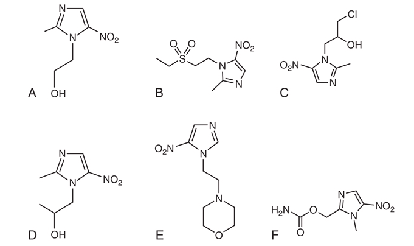

## Introduction

These notes accompany a ~1.5-hour lecture pairing two "miscellaneous" antibacterial topics: **metronidazole** and the **urinary tract agents** (nitrofurantoin, fosfomycin, methenamine). Although the textbook groups them separately, they share a single instructive theme — **pharmacology, not spectrum, determines clinical fate**. Metronidazole's near-complete absorption became a liability in luminal gut infection; the urinary agents succeed in cystitis precisely because they concentrate in urine and essentially nowhere else useful.

Part I is condensed from the metronidazole chapter (Nagel & Aronoff, Ch. 27, *Mandell, Douglas, and Bennett's Principles and Practice of Infectious Diseases*). Part II is drawn from Horton & Drekonja, "Urinary Tract Agents: Nitrofurantoin, Fosfomycin, and Methenamine" (Ch. 36), supplemented with the cornerstone cystitis guideline [@Gupta2011] and two landmark trials verified against the primary literature — the nitrofurantoin-versus-fosfomycin head-to-head [@Huttner2018] and the ALTAR methenamine non-inferiority trial [@HardingALTAR2022].

::: {.callout-note}
## The unifying theme
For all four drugs, a pharmacokinetic property — absorption, distribution, or site concentration — decides the clinical outcome more than the in vitro MIC does.
:::

## Learning Objectives

- Explain metronidazole's prodrug activation and why it is selective for anaerobes — and where that selectivity leaves gaps.
- Recall metronidazole's pharmacokinetics, signature toxicities, the warfarin interaction, and why it was demoted in *C. difficile* infection.
- Map the three urinary-tract agents — nitrofurantoin, fosfomycin, methenamine — to their mechanisms, niches, and correct clinical roles.
- Justify why nitrofurantoin and fosfomycin are first-line for cystitis but useless for pyelonephritis, and why methenamine is prophylaxis only.
- Apply the recent trial evidence (Huttner 2018, ALTAR 2022) that has refined how we use these agents.

# Part I — Metronidazole

## History and Structure

Azomycin (a 2-nitroimidazole) was isolated from a *Streptomyces* species in 1953; the 5-nitroimidazole derivative metronidazole was synthesized in 1959 and used for trichomoniasis. Its antibacterial potential was discovered serendipitously in 1962, when a patient treated for trichomoniasis had her acute ulcerative gingivitis resolve — the observation that opened the entire anaerobic indication. The class (metronidazole, tinidazole, secnidazole, ornidazole) is defined by an imidazole ring bearing a nitro group at position 5 — the business end of the molecule, since everything about mechanism and resistance turns on what happens to that nitro group.

{#fig-structure width="55%"}

## Mechanism of Action — An Inert Prodrug

Metronidazole is an inert prodrug whose spectrum is set entirely by a target organism's ability to activate it [@Edwards1993; @Dingsdag2018]. Four steps follow: (1) entry by passive diffusion; (2) reductive activation, in which an electron is transferred to the nitro group to form a short-lived, cytotoxic nitroso free radical — a step that establishes a concentration gradient driving further uptake; (3) cytotoxicity, as the activated compound damages DNA and produces strand breaks; and (4) release of inactive end-products.

{#fig-moa width="85%"}

::: {.callout-important}
## Why it is selective for anaerobes
Anaerobes reduce the nitro group using low-redox-potential electron carriers — ferredoxin or flavodoxin, reduced in turn by pyruvate:ferredoxin oxidoreductase (PFOR). Aerobes lack carriers negative enough to activate the drug, and the active form is re-oxidized to prodrug in the presence of oxygen — so activity is confined to anaerobic and microaerophilic niches. *Helicobacter pylori* uses an oxygen-insensitive nitroreductase (RdxA); *Giardia*, *Entamoeba*, and *Trichomonas* carry bacteria-like nitroreductases.
:::

@fig-selectivity contrasts the two fates of the drug. In the anaerobe, pyruvate:ferredoxin oxidoreductase (PFOR) reduces ferredoxin/flavodoxin, which donates an electron to the nitro group to form the cytotoxic nitroso radical that damages DNA — and activation itself pulls more drug into the cell. In the aerobe, oxygen re-oxidizes the radical straight back to the inert prodrug (futile cycling), so no cytotoxic species accumulates.

```{dot}
//| label: fig-selectivity
//| fig-cap: "Metronidazole selectivity. Anaerobes activate the prodrug via PFOR/ferredoxin to a DNA-damaging nitroso radical; in aerobes, oxygen re-oxidizes the radical back to inert prodrug (futile cycling)."
digraph selectivity {
    rankdir=TB;
    node [shape=box, style="rounded,filled", fontname="Helvetica", fillcolor="#e8e8e8", color="#999999", fontcolor="#222222"];
    edge [fontname="Helvetica", fontsize=10];

    P   [label="Metronidazole\n(inert prodrug)"];
    C   [label="Intracellular prodrug"];
    A   [label="Redox environment", shape=diamond, fillcolor="#f5f5f5"];
    PFOR[label="PFOR reduces\nferredoxin / flavodoxin"];
    R   [label="Nitroso free radical\n(active, cytotoxic)", fillcolor="#b20e10", color="#7a0a0b", fontcolor="#ffffff"];
    D   [label="DNA strand breaks\n→ cell death", fillcolor="#b20e10", color="#7a0a0b", fontcolor="#ffffff"];
    O   [label="O2 re-oxidizes radical"];

    P    -> C    [label="passive diffusion"];
    C    -> A;
    A    -> PFOR [label="Anaerobe"];
    PFOR -> R    [label="electron to -NO2"];
    R    -> D;
    R    -> C    [label="drives further uptake", style=dashed, constraint=false];
    A    -> O    [label="Aerobe"];
    O    -> P    [label="futile cycling"];
}
```

## Spectrum of Activity

Metronidazole is reliable against gram-negative anaerobes (*Bacteroides*, *Fusobacterium*, *Prevotella*, *Porphyromonas*) and the clostridia. It has a clinically important **intrinsic-resistance gap**: the non-spore-forming gram-positive anaerobes — *Actinomyces*, *Cutibacterium acnes*, *Lactobacillus*, *Bifidobacterium*, *Propionibacterium* [@Lofmark2010; @LeCorn2007]. Facultative organisms are not reliably covered.

::: {.callout-warning}
## Two infections metronidazole cannot treat
Actinomycosis and *Cutibacterium acnes* infections are not treatable with metronidazole because of intrinsic resistance — a classic trap when "covering anaerobes" empirically.
:::

Its antiprotozoal activity (*Trichomonas vaginalis*, *Giardia*, *Entamoeba histolytica*, *Dientamoeba fragilis*) follows from the same activation biology. This broad activity perturbs the anaerobic gut microbiome, which is part of the argument for preferring alternatives in some luminal indications.

The spectrum, and its gaps, are summarized in @tbl-spectrum. The organizing principle is selectivity by activation: organisms that reduce the nitro group in a low-redox environment are killed, while those that lack the low-potential electron carriers (aerobes and facultative organisms in their aerobic state) or that fail to accumulate the active form (the non-spore-forming gram-positive anaerobes) are not.

| Category | Representative organisms | Metronidazole activity |
|---|---|---|
| Gram-negative anaerobes | *Bacteroides*, *Fusobacterium*, *Prevotella*, *Porphyromonas* | Reliable |
| Gram-positive spore-forming anaerobes | *Clostridium* spp., *Clostridioides difficile* | Reliable (but no longer first-line for CDI) |
| Non-spore-forming gram-positive anaerobes | *Actinomyces*, *Cutibacterium acnes*, *Lactobacillus*, *Bifidobacterium*, *Propionibacterium* | Intrinsic gap — not covered |
| Microaerophilic / other | *Helicobacter pylori* (via RdxA) | Active in combination therapy |
| Microaerophilic protozoa | *Trichomonas vaginalis*, *Giardia*, *Entamoeba histolytica*, *Dientamoeba fragilis* | Reliable |
| Aerobes and facultative organisms | *Enterobacterales*, streptococci, staphylococci | Not covered |

: Metronidazole spectrum of activity and its intrinsic gaps [@Lofmark2010; @LeCorn2007] {#tbl-spectrum}

::: {.callout-note}
## Selectivity is set by activation, not the ring
Two mechanisms enforce anaerobic selectivity: only anaerobes carry electron carriers (ferredoxin/flavodoxin, fed by PFOR) negative enough to reduce the nitro group, and oxygen actively re-oxidizes the active form back to inert prodrug. This is why the drug is useless against aerobes yet retains activity against microaerophilic protozoa — and why the streptococcal co-pathogens of lung abscess (an aerobic/microaerophilic niche) escape it.
:::

## Pharmacokinetics

Metronidazole has near-ideal pharmacokinetics for an anti-anaerobe: oral bioavailability approaches 100%, protein binding is under 20%, and tissue penetration is excellent — cerebrospinal fluid concentrations approximate serum even with non-inflamed meninges, and penetration into abscesses, bile, and peritoneal and pancreatic tissue is very good [@Freeman1997]. The parent half-life is roughly 6–10 hours (mean about 8 hours); hepatic oxidation is the main elimination route, yielding an active hydroxy metabolite that retains 30–65% of the parent's activity and has a longer half-life (~11–13 hours). Killing is **concentration-dependent** (like the aminoglycosides and fluoroquinolones), so the pharmacodynamic driver is **AUC/MIC**, not time above MIC.

::: {.callout-tip}
## Dose adjustment: hepatic yes, renal (mostly) no
Reduce the dose by 50% in significant hepatic disease. Routine renal adjustment is not required, but patients on intermittent hemodialysis need a supplemental dose after each session. Note the recurring irony: the complete absorption that makes the drug so well distributed is exactly what undermines it in the colonic lumen (see CDI, below).
:::

## Dosing and the Case for Twice-Daily Administration

Metronidazole has traditionally been dosed every 8 hours, but because killing is concentration-dependent the relevant pharmacodynamic index is AUC/MIC, and a fixed total daily dose meets that target largely regardless of how it is divided. Monte Carlo simulation puts the anaerobic target at AUC/MIC ≥ 70; a total of 1000 mg/day achieves greater than 99% target attainment against *Bacteroides fragilis* at an MIC below 2 mg/L, whether given q8h or q12h [@Sprandel2006; @Lewis2000]. The long parent half-life (~8 hours) and the active hydroxy metabolite (~11–13 hours) together sustain exposure across a 12-hour interval: on 500 mg q12h, measured troughs (~6–7 mg/L) sit at or below the CLSI anaerobe breakpoint (≤ 8 mg/L) while peaks reach ~17–24 mg/L [@Earl1989].

The clinical evidence for q12h dosing is accumulating but remains observational. Earl 1989 is the classic pharmacokinetic anchor: 48 surgical patients on 12-hourly metronidazole had IV troughs averaging 6.7 mg/L, above the MIC of most obligate anaerobes [@Earl1989]. Soule 2018 (single-centre, *n* = 200) found no difference in clinical cure between q8h and q12h in anaerobic or mixed infections, though it lacked culture data [@Soule2018]. The Shah studies tightened this by restricting to culture-proven disease — obligate-anaerobe bacteraemia (2021, *n* = 85; no difference in mortality, length of stay, or escalation) and then *Bacteroides* bloodstream infection specifically (2024, *n* = 242; clinical failure 15% vs 18% and 30-day mortality 15% vs 17%, no significant difference) [@Shah2021; @Shah2024]. No randomized trial exists, and the data do not extend to CDI, CNS infection, or amebiasis, where luminal or sustained high exposure matters. Where they apply, the practical advantages of twice-daily dosing are real: fewer doses, less nursing and pharmacy time, better adherence, and lower cumulative-dose neurotoxicity risk.

## Dosing by Indication

Typical regimens are summarized in @tbl-mtz-dosing. Note the recurring 500 mg unit, the shift toward q12h dosing for many indications, and the requirement to follow amebic disease with a luminal agent. Halve all of these in significant hepatic disease.

| Indication | Typical regimen |
|---|---|
| Serious anaerobic infection | 500 mg IV/PO q8–12h |
| Bacterial vaginosis | 500 mg PO bid × 7 d (or vaginal gel) |
| Trichomoniasis | 500 mg PO bid × 7 d |
| Giardiasis | 250 mg PO tid × 5–7 d |
| Amebic colitis / liver abscess | 500–750 mg PO tid × 7–10 d + luminal agent |
| *H. pylori* (as part of quadruple therapy) | 500 mg PO bid–tid |

: Metronidazole dosing by indication {#tbl-mtz-dosing}

## Adverse Effects

Most adverse effects are mild, dose-dependent, and reversible — nausea, a metallic taste, and GI upset. Prolonged therapy (beyond about four weeks) is associated with reversible central nervous system toxicity (encephalopathy, ataxia, dysarthria, seizures) and peripheral neuropathy [@Kuriyama2011]. Metronidazole should be avoided in the first trimester of pregnancy, though large studies have not demonstrated a clear malformation signal with later exposure [@DiavCitrin2001].

## Drug Interactions

::: {.callout-warning}
## Warfarin is the dangerous one
Metronidazole inhibits the metabolism of S-warfarin, producing a marked rise in INR; a pre-emptive warfarin dose reduction of roughly 20–30% with close monitoring is prudent [@Holt2010]. It also raises busulfan, lithium, phenytoin, and calcineurin-inhibitor levels.
:::

The disulfiram-like reaction with alcohol is widely taught but rests on contested evidence — one controlled study found none [@Visapaa2002]. Advising abstinence remains reasonable, but the certainty is weaker than the teaching implies; tinidazole and secnidazole are not CYP2E1 substrates and are unlikely to cause it.

## Resistance Mechanisms

All proposed mechanisms follow from the activation pathway: reduced uptake, efflux, reduced activation, drug inactivation, and enhanced DNA repair [@Dingsdag2018]. In anaerobes, the best-characterized mechanism is the *nim* genes (*nimA*–*nimH*), encoding a reductase that converts the nitro group to an inert amino derivative — though carriage of a *nim* gene does not reliably predict phenotypic resistance [@Alauzet2017]. In *H. pylori*, resistance arises from loss of activation via *rdxA*/*frxA* mutations (global prevalence now 40–90%). In *Trichomonas*, clinical failure is usually "aerobic resistance," in which raised intracellular oxygen reoxidizes the active radical. Refractory giardiasis is increasing.

## Clinical Uses

**Trichomoniasis** is the indication metronidazole still fully owns — the nitroimidazoles are the only FDA-approved class, a 7-day regimen is now preferred over single-dose in women, and partners are treated [@Workowski2021]. **Giardiasis** first-line has shifted to tinidazole or nitazoxanide, with metronidazole as an alternative. **Amebiasis** (invasive colitis, liver abscess) is treated with a tissue amebicide followed by a luminal agent such as paromomycin. **Anaerobic infections** — intra-abdominal, CNS (brain abscess, where CSF penetration is a genuine advantage), gynecologic, oral/dental — are core indications, as is **bacterial vaginosis** (oral or vaginal, comparable to clindamycin). Metronidazole remains a component of *H. pylori* quadruple therapy, working even when the isolate tests resistant in vitro [@Shih2022].

::: {.callout-important}
## The lung abscess exception
Metronidazole monotherapy fails in anaerobic lung abscess — a comparative trial against clindamycin was stopped early [@Perlino1981]. The reason is spectrum, not penetration: it misses the co-infecting aerobic and microaerophilic streptococci. Adding a β-lactam corrects this.
:::

### The CDI demotion

Metronidazole was once first-line for *Clostridioides difficile* infection; it no longer is. A meta-analysis found vancomycin superior in severe disease, a large cohort found lower mortality with vancomycin in severe CDI, and a Cochrane review concluded vancomycin or fidaxomicin is superior to metronidazole [@Li2015; @Nelson2017]. Current IDSA/SHEA guidance recommends fidaxomicin or vancomycin, not oral metronidazole, as first-line [@Johnson2021].

::: {.callout-tip}
## Why metronidazole failed in CDI
Two pharmacologic reasons. It is almost completely absorbed in the upper gut, so colonic luminal concentrations are low and variable — and stool concentrations fall as diarrhea resolves, exactly when drug is still needed. And metronidazole resistance in *C. difficile* is emerging. Vancomycin and fidaxomicin, being non-absorbed, deliver reliably high luminal concentrations.
:::

## Other and Topical Uses

Beyond the core anaerobic and antiprotozoal indications, metronidazole has a tail of niche uses: inflammatory bowel disease (best evidence in perianal Crohn disease and pouchitis), topical dermatologic formulations for rosacea and acne, and historical high-dose use as a radiosensitizer. These are worth recognizing but are not why one reaches for the drug.

## Other Nitroimidazoles

Tinidazole, secnidazole, and ornidazole share metronidazole's mechanism, spectrum, and toxicity; their distinguishing feature is a longer half-life permitting once-daily or single-dose regimens for amebiasis, giardiasis, trichomoniasis, and bacterial vaginosis, often with better tolerability [@Lamp1999]. Metronidazole, however, remains the drug of choice for life-threatening anaerobic infection, where efficacy and safety data for the others are limited.

# Part II — Urinary Tract Agents

## Defining the Target

Nitrofurantoin and fosfomycin are first-line for **acute uncomplicated cystitis** — bladder-confined infection in a non-pregnant woman with a normal tract — chosen for their pharmacology, efficacy, safety, and low collateral damage [@Gupta2011]. Both reach useful concentrations essentially only in urine, which is a feature for cystitis and a hard limit for tissue infection. **Complicated UTI and pyelonephritis** require agents with parenchymal and serum levels; the urinary agents fail there. Methenamine is not truly an antibiotic until the bladder converts it, and is used for **prophylaxis only**. Asymptomatic bacteriuria is generally not treated, the exceptions being pregnancy and pre-urologic-instrumentation.

The efficacy of the common cystitis agents is summarized in @tbl-cystitis.

| Agent | Dose | Clinical efficacy | Notes |
|---|---|---|---|
| Nitrofurantoin | 100 mg bid × 5 d | ~88–93% | first-line; not for pyelonephritis |
| TMP-SMX | 160/800 mg bid × 3 d | ~93% | rising resistance limits empiric use |
| Fosfomycin | 3 g single dose | ~91% clinical (~80% microbiologic) | convenient; slightly less effective |
| Fluoroquinolone | varies × 3 d | ~90% | reserve — collateral damage |
| β-lactam | varies × 3–5 d | ~89% | generally less effective |

: Efficacy of agents commonly used for uncomplicated cystitis (adapted from Gupta et al. 2011) {#tbl-cystitis}

## Nitrofurantoin

Nitrofurantoin is a synthetic nitrofuran (a weak acid) reduced by bacterial nitroreductases to reactive intermediates that damage ribosomes, DNA, and the Krebs cycle. Because it acts at **multiple sites**, resistance is uncommon even after 70 years of use. It is active against more than 90% of uropathogenic *E. coli*, *S. saprophyticus*, and enterococci (including many vancomycin-resistant strains), but *Proteus* and *Pseudomonas* are intrinsically resistant and *Klebsiella*, *Enterobacter*, and *Serratia* are unreliable [@Gupta2011].

### Formulations and pharmacology

The microcrystalline form (Furadantin) is absorbed rapidly and more completely (43%) but causes more GI upset; the macrocrystalline form (Macrodantin) is absorbed more slowly (36%) and is better tolerated; the monohydrate/macrocrystal mixture (Macrobid) is dosed 100 mg twice daily. Serum concentrations are negligible, while urinary concentrations (50–250 µg/mL) far exceed the MIC — the drug is a pure bladder agent, with prostatic and tissue levels too low for tissue infection. It is renally cleared; the package insert advises against use below a creatinine clearance of 60 mL/min, whereas the American Geriatrics Society is more permissive, advising avoidance below 30 mL/min or for long-term suppression [@AGS2019Beers].

### Clinical use

Nitrofurantoin is first-line for acute uncomplicated cystitis as a 5-day course, and effective for prophylaxis of recurrent UTI (100 mg daily, or a post-coital single dose) [@Muller2017]. It must not be used for pyelonephritis or complicated UTI — breakthrough bacteremia has occurred during therapy. The most rigorous head-to-head trial found 5-day nitrofurantoin **superior** to single-dose fosfomycin (clinical resolution 70% vs 58% at 28 days) [@Huttner2018], which has nudged many clinicians toward nitrofurantoin as the preferred first-line where renal function allows.

::: {.callout-warning}
## Toxicities to know
The signature serious reaction is pulmonary hypersensitivity — an acute form (hours to weeks: fever, cough, dyspnea, eosinophilia, infiltrates, reversible) and a chronic form (months: insidious interstitial fibrosis, potentially irreversible) [@Santos2016]. Hepatotoxicity (acute reversible; chronic active hepatitis with prolonged use), hemolytic anemia in G6PD deficiency, and peripheral neuropathy (especially in renal failure) also occur.
:::

### Pregnancy and interactions

Nitrofurantoin is preferred for cystitis in the second and third trimesters (category B) but should be avoided at term, with imminent delivery, or in neonates because of the risk of hemolytic anemia in mother and baby; ACOG advises first-trimester use only when alternatives are contraindicated. Avoid co-administration with other methemoglobinemia-inducers; there is a hyperkalemia signal (caution with spironolactone/triamterene), and antacids reduce absorption.

## Fosfomycin

Discovered in 1969, fosfomycin is a small (138 Da), water-soluble **phosphonic-acid** antibiotic that blocks the first committed step of peptidoglycan synthesis (inhibiting MurA/enolpyruvyl transferase) after entering the cell through glycerophosphate and hexose-phosphate transporters — a route whose loss confers resistance [@Falagas2016]. It has broad gram-negative activity including more than 95% of ESBL *E. coli*, and *E. faecalis*/*E. faecium* are susceptible; *Pseudomonas* is variable and *Acinetobacter* usually resistant. Resistance arises from transport loss or Fos enzymes that break the oxirane ring. In the US only the oral tromethamine salt is available (for cystitis); parenteral fosfomycin is a European systemic option.

### Pharmacology and dosing

Fosfomycin is best absorbed before food (~40% absorbed) and is not metabolized; its long half-life sustains urinary concentrations near 2000 µg/mL for more than 24 hours from a single dose. The dose for uncomplicated cystitis is 3 g of oral powder dissolved in at least half a cup of water — never taken dry — as a single dose; for complicated UTI, 3 g every 48–72 hours has been used.

### Role and evidence

IDSA lists fosfomycin as first-line for cystitis for its ease of administration and preserved activity against uropathogenic *E. coli*, while cautioning that it may be slightly less effective [@Gupta2011]; its microbiologic cure (~80%) trails comparators, and the Huttner trial found the single dose inferior to 5-day nitrofurantoin [@Huttner2018]. Its real value is as an oral option for MDR uropathogens — ESBL- and some KPC-producing Enterobacterales — where alternatives are IV, and it has off-label roles in prostatitis and pre-prostate-biopsy prophylaxis owing to prostatic penetration. It is well tolerated (diarrhea, nausea, headache; rare optic neuritis and anaphylaxis), but rising community use has been paralleled by increasing fosfomycin resistance in ESBL *E. coli*. It is not indicated for pyelonephritis.

### Intravenous fosfomycin — a European systemic agent

The Mandell chapter, written from a US perspective, treats fosfomycin almost entirely as the oral cystitis drug. In Italy and much of Europe, however, **intravenous fosfomycin** (the disodium salt) is an established *systemic* antibiotic — a distinct clinical entity from the 3 g oral tromethamine sachet, even though it is the same molecule.

Its principal role is as a **combination partner** for serious multidrug-resistant gram-negative infection — carbapenem-resistant Enterobacterales (including KPC producers), MDR *Pseudomonas aeruginosa*, and *Acinetobacter baumannii*. The rationale is pharmacological: fosfomycin's unique early cell-wall target (MurA) confers no cross-resistance with other classes and produces documented in vitro and in vivo **synergy** with β-lactams, polymyxins, and aminoglycosides [@Grabein2017; @ZayyadPaul2017]. Because resistant subpopulations emerge rapidly on treatment — especially in *Pseudomonas* — it should **never be used as monotherapy** for serious infection.

Typical European dosing is high and divided — 4 g every 6 hours or 6–8 g every 8 hours (12–24 g/day), frequently in combination, with renal dose adjustment. Unlike the oral urinary niche, IV fosfomycin distributes usefully to CSF, bone, and soft tissue.

#### Salt and water overload — the dominant practical liability

Intravenous fosfomycin is given as the **disodium salt**, and its sodium content is clinically significant: roughly **11–14 mmol of sodium per gram** of drug (preparation-dependent). A full treatment regimen of 16 g/day therefore delivers on the order of **175–220 mmol of sodium per day** — more than the sodium in a litre of 0.9% saline — before maintenance fluids, line flushes, and other sodium-containing drugs are counted. In patients with decompensated heart failure, cirrhosis with ascites, severe hypertension, or oliguric renal failure this can precipitate frank **volume overload and pulmonary oedema**. The large distal-nephron sodium delivery also drives renal potassium wasting, producing the **hypokalaemia** (and occasionally metabolic alkalosis) prominent in trials such as ZEUS, alongside transient transaminase elevations.

::: {.callout-warning}
## Managing the sodium/fluid burden
Screen for high-risk patients (heart failure, ascites, severe hypertension, poor renal function) before starting. Monitor daily weight, fluid balance, and blood pressure, and check serum potassium and magnesium with proactive replacement. Count the fosfomycin sodium in the patient's total daily sodium budget, minimise sodium in co-administered fluids, and use diuretics where appropriate. This burden is a genuine reason IV fosfomycin remains a combination/second-line agent rather than a workhorse.
:::

#### Does the clinical evidence support IV fosfomycin?

The evidence base is uneven, and it is worth summarizing honestly.

**Supporting.** The pivotal registration trial, **ZEUS**, found intravenous fosfomycin (ZTI-01, 6 g every 8 hours) **non-inferior** to piperacillin-tazobactam for complicated UTI and acute pyelonephritis [@Kaye2019zeus]. Beyond UTI, the case rests on in vitro synergy and observational cohorts in carbapenem-resistant Enterobacterales and MDR *Pseudomonas aeruginosa*, and on expert guidance: the 2024 **SIMIT/SPILF** (Italian–French) practical recommendations endorse specific fosfomycin **combinations** — for example cefiderocol plus fosfomycin for resistant *P. aeruginosa* pneumonia, and ceftazidime-avibactam plus fosfomycin for carbapenem-resistant *P. aeruginosa* neurological infection [@Meschiari2024].

**Not, or only weakly, supporting.** The **FOREST** randomized trial is the cautionary counterpoint: as targeted therapy for multidrug-resistant *E. coli* bacteraemic UTI, intravenous fosfomycin (4 g every 6 hours) **did not meet non-inferiority** against ceftriaxone or meropenem (clinical-microbiological cure 68.6% vs 78.1%), and the shortfall was driven by **adverse-event–related discontinuations** (8.5% vs 0%) rather than microbiological failure — the salt/water and electrolyte toxicities in practice [@SojoDorado2022forest]. Notably, the fosfomycin arm acquired fewer new ceftriaxone- or meropenem-resistant gram-negatives, an ecological point in its favour. More broadly, most non-UTI evidence is observational and low-quality, and randomized trials in severe MDR infection are lacking [@Grabein2017; @ZayyadPaul2017]. The net position: reasonable as part of **combination therapy**, or when better-tolerated options are exhausted, but not established as first-line monotherapy and not proven for serious bacteraemia.

::: {.callout-note}
## The gram-positive angle — occasionally MRSA
Intravenous fosfomycin retains activity against many gram-positives, including MRSA and some VRE, and is used as a **combination partner** rather than alone. In a Spanish randomized trial, **daptomycin plus fosfomycin** versus daptomycin alone for MRSA bacteraemia and endocarditis produced a 12% higher rate of treatment success (not statistically significant) but significantly **fewer microbiologic failures** and less complicated bacteraemia, at the cost of **more adverse events** [@Pujol2021]. It is therefore a reasonable adjunct in persistent or complicated MRSA bacteraemia when potentiation of daptomycin is desired — a salvage-oriented, not routine, choice. Fosfomycin's cell-wall action synergizes with daptomycin's membrane effect.
:::

## Methenamine

Methenamine (hexamethylenetetramine) itself has little antibacterial activity; in acidic urine (pH <6) each molecule hydrolyzes to formaldehyde (plus ammonia), a nonspecific denaturant of proteins and nucleic acids with broad activity and **no described microbial resistance** [@Gleckman1979; @Musher1974]. It is available as hippurate (Hiprex) or mandelate salts — the acid component aids urinary acidification — or without an acid. It is rapidly absorbed, ~95% renally excreted, with a short serum half-life (3–4 hours) [@Klinge1982]. Urease-producing organisms such as *Proteus* alkalinize the urine and block conversion.

::: {.callout-important}
## Why methenamine is prophylaxis only
Formaldehyde generation takes hours (about 2 hours at pH 5.6, 6 hours at pH 6.5), so it requires urinary dwell time. It is therefore ineffective with indwelling catheters or urostomies (urine is flushed too quickly) and for pyelonephritis or any upper-tract infection (no ureteral activity). Dosing is methenamine hippurate 1 g orally twice daily for prevention.
:::

### Safety and the ALTAR trial

Side effects are usually mild (nausea, rash); high doses can cause GI upset and hemorrhagic cystitis from bladder formaldehyde. It should be avoided in hepatic failure (ammonia generation) and may precipitate urate crystals and sulfonamides. The pragmatic ALTAR trial (BMJ 2022) found methenamine hippurate **non-inferior** to daily antibiotic prophylaxis for recurrent UTI in women, with less antibiotic-resistance selection [@HardingALTAR2022], repositioning it as a credible antibiotic-sparing preventive — upgrading the older, smaller crossover evidence [@Cronberg1987].

## Putting the Urinary Agents Together

| | Nitrofurantoin | Fosfomycin | Methenamine |
|---|---|---|---|
| Role | Cystitis treatment | Cystitis treatment | Prophylaxis only |
| Mechanism | Multi-target (nitroreduction) | MurA / cell wall | → formaldehyde (acid urine) |
| Pyelonephritis | No | No | No |
| Key limitation | Renal function; lung/liver toxicity | Slightly lower efficacy; Fos resistance | Needs acid urine and dwell time |
| Resistance | Rare | Transport / Fos enzymes | None described |

: The three urinary tract agents side by side {#tbl-uti}

A practical dosing reference is given in @tbl-uti-dosing. Two absolute rules travel with it: nitrofurantoin and fosfomycin treat cystitis but never pyelonephritis, and methenamine is prophylaxis only.

| Agent | Regimen (uncomplicated cystitis / prophylaxis) |
|---|---|
| Nitrofurantoin (Macrobid) | 100 mg PO bid × 5 d; prophylaxis 50–100 mg daily |
| Fosfomycin | 3 g single oral dose (before food); complicated: 3 g q48–72h |
| Methenamine hippurate | 1 g PO bid — prevention only; needs acidic urine |

: Dosing quick reference for the urinary tract agents {#tbl-uti-dosing}

Their coverage of common uropathogens differs in instructive ways, summarized in @tbl-uti-spectrum. Nitrofurantoin and fosfomycin have defined bacterial spectra with characteristic gaps, whereas methenamine's activity is a chemical rather than a microbiological property — formaldehyde is a nonspecific denaturant active against essentially all uropathogens, provided the urine is acidic and the organism does not raise urinary pH.

| Uropathogen | Nitrofurantoin | Fosfomycin | Methenamine |
|---|---|---|---|
| *E. coli* (incl. ESBL) | Reliable (>90%) | Reliable (>95% ESBL) | Active† |
| *S. saprophyticus* | Reliable | Reliable | Active† |
| Enterococci (incl. many VRE) | Reliable | Reliable (*E. faecalis*/*E. faecium*) | Active† |
| *Klebsiella* / *Enterobacter* / *Serratia* | Unreliable | Variable–generally active | Active† |
| *Proteus* spp. | Intrinsically resistant | Variable | Ineffective (urease → alkaline urine)‡ |
| *Pseudomonas aeruginosa* | Intrinsically resistant | Variable | Limited |
| *Acinetobacter* | Intrinsically resistant | Usually resistant | Limited |

: Uropathogen coverage of the three urinary tract agents {#tbl-uti-spectrum}

†Methenamine's formaldehyde is a nonspecific denaturant with broad activity and no described resistance, but it acts only in acidic urine (pH <6) and requires bladder dwell time — so it is a prophylactic, not a treatment, agent. ‡Urease-producing organisms such as *Proteus* alkalinize the urine and block formaldehyde generation [@Gupta2011; @Falagas2016; @Musher1974].

The stewardship rationale unifies them: guidelines favour nitrofurantoin, fosfomycin, and TMP-SMX over fluoroquinolones for uncomplicated cystitis because of less collateral damage to the microbiome and resistome, and methenamine extends the antibiotic-sparing idea to prevention. Their shared limit is that none reaches tissue or serum levels — anything beyond the bladder requires escalation.

## Key Takeaways

Across all four agents, pharmacology rather than spectrum decides the outcome. **Metronidazole** is a prodrug, anaerobe-selective, with superb penetration; halve its dose in hepatic disease and supplement after dialysis; remember its intrinsic gaps (*Actinomyces*, *C. acnes*), its failure in lung abscess, its demotion in CDI, and the warfarin interaction. **Nitrofurantoin and fosfomycin** are first-line for cystitis, concentrate only in urine, and must never be used for pyelonephritis; the best trial evidence favours 5-day nitrofurantoin over single-dose fosfomycin. **Methenamine** generates formaldehyde in situ, provokes no resistance, and is prophylaxis only, now validated by ALTAR. Stewardship favours all of these agents over fluoroquinolones for uncomplicated cystitis.

## References {.unnumbered}

::: {#refs}
:::
